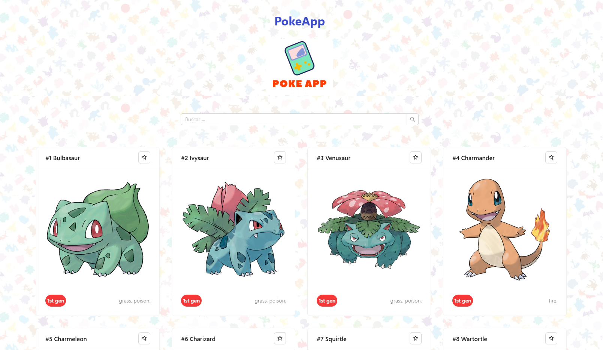
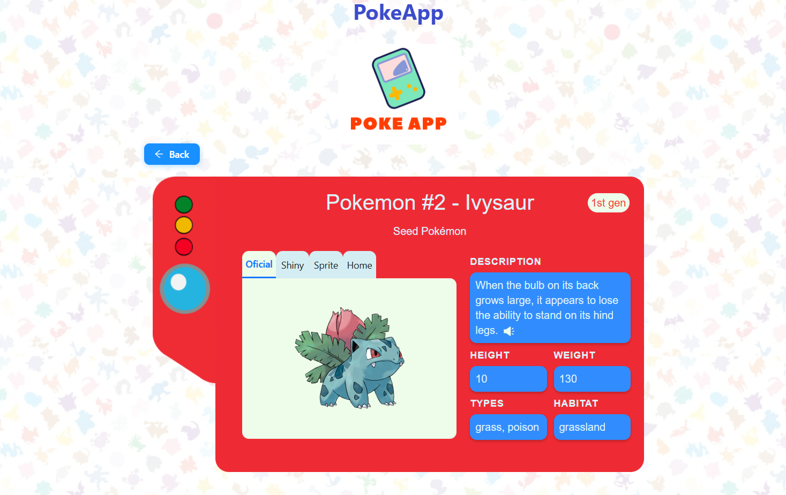

# 🎮 PokeApp

Bienvenido a mi app de Pokemon, PokeApp. Esta app permite listar a todos los 1025 pokemon desde la
1ra hasta la 9na y última generación. Permite buscarlos, marcar favoritos, y escuchar su descripción de forma similar a como lo hace la pokedex en el anime, diseñado e inspirado en la Pokédex de Kanto. 

## 📸 Imágenes




## 🌐 Demo en Vivo

**¡Prueba la aplicación aquí!** 👉🚀 [Ver Demo](https://poke-app-one-nu.vercel.app/)

### 🎥 Video Demostrativo

<a href="https://youtube.com/watch?v=w1oqGJVk4NM" target="_blank">
  
</a>

## 📋 Características

### 🌟 Funcionalidades Principales
- **Catálogo de Pokémon**: Navega y explora las 9 generaciones de Pokemon
- **Búsqueda**: Filtra y busca Pokémon por nombre
- **Detalles Completo**: Vista detallada de cada Pokémon con estadísticas, tipos y generaciones
- **Favoritos**: Marca tus Pokémon favoritos para acceso rápido
- **Síntesis de Voz**: Descripción de Pokémon narrada similar a como lo hace la Pokedex original en
el anime.
- **Diseño Responsivo**: Optimizado para móviles, tablets y desktops

### 🎨 Características Técnicas
- **Páginas de Error Personalizadas**: Página 404 temática con Ditto
- **Datos enlazados**: Datos de 2 endpoints de la API para obtener información detallada de cada Pokemon
- **Navegación Fluida**: Sistema de rutas con React Router
- **Estado Global**: Gestión centralizada con Redux
- **UI Moderna**: Componentes de Ant Design

## 🛠️ Stack Tecnológico

### Frontend
- **React 19.2.0** 
- **React Router 7.14.2** 
- **Redux 5.0.1** 
- **Redux Thunk 3.1.0** 
- **Ant Design 5.29.1** 
- **Vite 7.2.2** 

### Estilos y Diseño
- **CSS3 Animations** - Animaciones y transiciones
- **Responsive Design** - Diseño adaptativo

### APIs y Datos
- **PokéAPI** - Fuente de datos oficial de Pokémon
- **Axios 1.13.2** - Cliente HTTP para peticiones API

## 🚀 Instalación y Configuración

### Prerrequisitos
- Node.js 18+ 
- npm o yarn

### Pasos de Instalación

1. **Clonar el repositorio**
```bash
git clone https://github.com/jesusalarcondev/poke-app.git
cd poke-app
```

2. **Instalar dependencias**
```bash
npm install
```

3. **Iniciar servidor de desarrollo**
```bash
npm run dev
```

4. **Abrir en navegador**
```bash
# La aplicación estará disponible en http://localhost:5173
```


## 📁 Estructura del Proyecto

```
src/
├── components/          # Componentes React
│   ├── Loading.jsx      # Componente de carga
│   ├── PokemonCard.jsx  # Tarjeta de Pokémon
│   ├── PokemonDetail.jsx # Vista detallada
│   ├── PokemonList.jsx  # Lista de Pokémon
│   ├── Searcher.jsx     # Barra de búsqueda
│   ├── StarButton.jsx   # Botón de favoritos
│   └── NotFound.jsx     # Página 404 personalizada
├── actions/             # Acciones Redux
│   ├── index.js         # Definición de acciones
│   └── types.js         # Tipos de acciones
├── reducers/            # Reducers Redux
│   └── pokemons.js      # Reducer de Pokémon
├── middlewares/         # Middlewares Redux
│   └── index.js         # Logger y otros middlewares
├── utils/               # Utilidades
│   ├── capitalizeUtils.js    # Capitalización de texto
│   ├── flavorTextUtils.js     # Procesamiento de descripciones
│   └── generationName.js     # Nombres de generaciones
├── api/                 # Configuración de API
│   └── index.js         # Cliente API
├── assets/              # Recursos estáticos
│   └── icono-poke-app.png    # Logo de la aplicación
├── App.jsx              # Componente principal
├── main.jsx             # Punto de entrada
└── index.css            # Estilos globales
```

## 🎯 Características Destacadas

### 📱 Diseño Personalizado
- **Pokedex Design**: Dibujé con Diseño Vectorial e Inkscape la imagen lateral de la Pokedex,
usando la paleta de colores e inspiración de la Pokedex de Kanto

### 🎨 Tema y Estilo
- **Pokédex Theme**: Diseño inspirado en la Pokédex clásica
- **Ditto Integration**: Elementos temáticos con Ditto
- **Color Scheme**: Paleta de colores coherente con la marca Pokémon

### 🔍 Búsqueda y Filtrado
- **Búsqueda en Tiempo Real**: Filtrado instantáneo mientras escribes
- **Case Insensitive**: Búsqueda sin distinguir mayúsculas/minúsculas
- **Paginación**: Navegación a través de grandes listas

### 🎤 Síntesis de Voz
- **Narración Automática**: Descripciones de Pokémon leídas en voz alta

## 🏗️ Arquitectura

### Gestión de Estado
- **Redux Store**: Estado centralizado para la aplicación
- **Actions**: Acciones asíncronas para carga de datos
- **Reducers**: Lógica de actualización del estado
- **Selectors**: Acceso optimizado al estado

### Componentes
- **Componentes Funcionales**: Uso moderno de React con hooks
- **Props Drilling**: Flujo de datos predecible
- **Reusable Components**: Componentes reutilizables y modulares

### Rutas
- **/**: Página principal con lista de Pokémon
- **/pokemon/:id**: Vista detallada de Pokémon específico
- **\***: Página 404 personalizada

## 🎨 Componentes UI

### PokemonCard
- Tarjeta interactiva con información básica
- Botón de favoritos funcional
- Navegación a detalles

### PokemonDetail
- Vista completa con estadísticas
- Pestañas para diferentes sprites
- Síntesis de voz

### NotFound
- Página 404 temática con Ditto
- Navegación de regreso al inicio

## 🤝 Contribución
¡Busco mejorar asi que cualquier feedback y aporte es bien recibido! 
P.D: Si alguien sabe de Diseño me gustaría mejorar la pokedex.

### Flujo de Trabajo
1. Fork del repositorio
2. Crear feature branch (`git checkout -b feature/amazing-feature`)
3. Commit cambios (`git commit -m 'Add amazing feature'`)
4. Push al branch (`git push origin feature/amazing-feature`)
5. Abrir Pull Request

## 📝 Licencia

Este proyecto está bajo la Licencia MIT. Ver el archivo [LICENSE](LICENSE) para más detalles.

## 👨‍💻 Autor

**Jesús Alarcón**
- GitHub: [@jesusalarcondev](https://github.com/jesusalarcondev)
- Portfolio: [jesusmanuelalarcon.com](https://www.jesusmanuelalarcon.com)

## ⚠️ Disclaimer

**Pokémon®** es una marca registrada propiedad de Nintendo, Creatures Inc., y GAME FREAK Inc. 

Este proyecto **PokeApp** es una aplicación web desarrollada con fines **únicamente educativos** como parte de un portafolio de desarrollo web y para demostrar habilidades en React, Redux, y consumo de APIs.

- **No es un producto oficial** de Nintendo o sus empresas afiliadas
- **No tiene fines comerciales** ni busca generar beneficios económicos
- **Utiliza datos de PokéAPI** que están disponibles públicamente para uso educativo
- **Todos los derechos** sobre los personajes, imágenes y marcas registradas pertenecen a sus respectivos dueños

Este proyecto respeta la propiedad intelectual y se mantiene dentro de los límites del uso educativo y no comercial.

---

🎮 **¡Disfruta explorando el mundo de Pokémon!** 🎮
